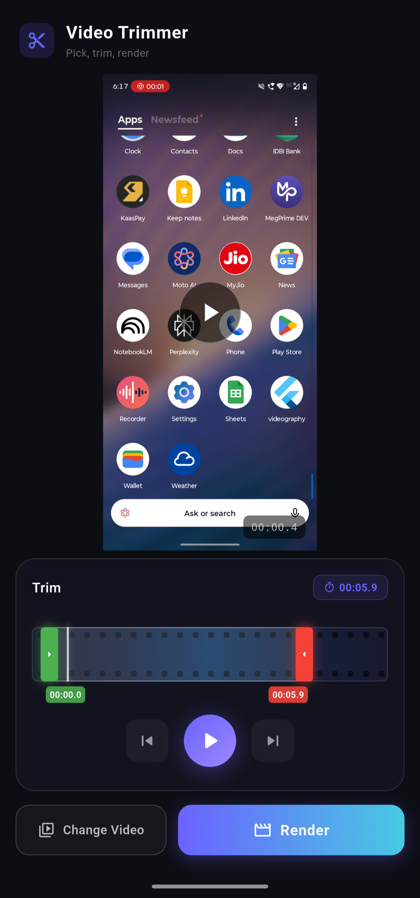

# Flutter Videography

A clean, minimal video trimming app for iOS and Android built with Flutter. Pick a video, drag the trim handles, preview your clip, and export it straight to your gallery — all powered by FFmpegKit under the hood.

---

## Features

- 🎬 **Pick any video** from your device library
- 🎚️ **Dual-handle trim slider** — drag start and end points independently
- ▶️ **Live preview** — playback is clamped to your selected trim region
- ⚡ **Frame-accurate cuts** — FFmpeg `-c copy` for fast, lossless trimming
- 📁 **Export to gallery** — saved directly to Photos / Gallery via `gal`
- 🌑 **Dark UI** — Material 3 dark theme throughout

---

## Screenshots

 

---

## Tech Stack

| Layer | Package |
|---|---|
| Video playback | `video_player` |
| FFmpeg execution | `ffmpeg_kit_flutter_new_min` |
| File picking | `file_picker` |
| Gallery export | `gal` |
| Path resolution | `path_provider` |

---

## Getting Started

### Prerequisites

- Flutter 3.x+
- Dart 3.x+
- Xcode (iOS) / Android Studio (Android)

### Installation

```bash
git clone https://github.com/yourusername/flutter-video-trimmer.git
cd flutter-video-trimmer
flutter pub get
flutter run
```

### iOS — Required `Info.plist` entries

```xml
<key>NSPhotoLibraryUsageDescription</key>
<string>Used to save trimmed videos to your gallery.</string>

<key>NSPhotoLibraryAddUsageDescription</key>
<string>Used to save trimmed videos to your gallery.</string>
```

### Android — Required permissions (`AndroidManifest.xml`)

```xml
<uses-permission android:name="android.permission.READ_MEDIA_VIDEO"/>
<uses-permission android:name="android.permission.WRITE_EXTERNAL_STORAGE"
    android:maxSdkVersion="28"/>
```

---

## How It Works

1. User picks a video — loaded into `VideoPlayerController` for preview
2. Dual-handle slider sets `startSeconds` and `endSeconds`
3. On render, a `TrimJob` is built with the input path, output path, and trim values
4. FFmpegKit executes the trim command on a **native background thread** (no isolate needed — FFmpegKit handles its own threading via platform channels)
5. Output is saved to the gallery via `gal`

### FFmpeg command used

```
ffmpeg -y -ss <start> -i <input> -t <duration> -c copy <output>
```

`-ss` before `-i` enables fast seek. `-c copy` avoids re-encoding for instant, lossless output.

---

## Project Structure

```
lib/
├── models/
│   └── trim_job.dart          # Data class: input, output, start, end
├── screens/
│   └── video_editor_screen.dart  # Main UI + playback + render logic
├── services/
│   └── video_trimmer_service.dart  # FFmpegKit execution
└── widgets/
    └── video_trim_slider.dart  # Custom dual-handle range slider
```

---

## License

MIT
